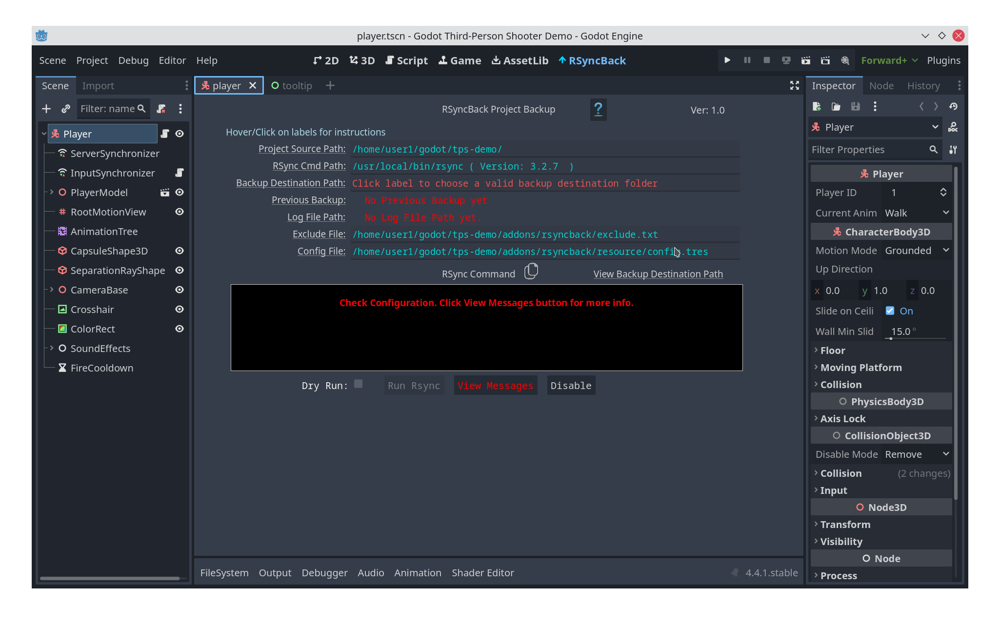
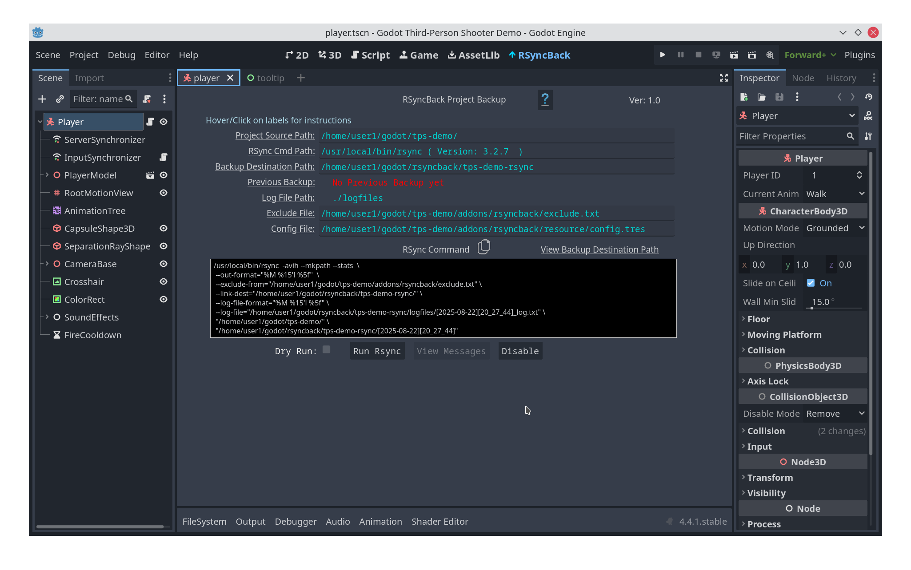
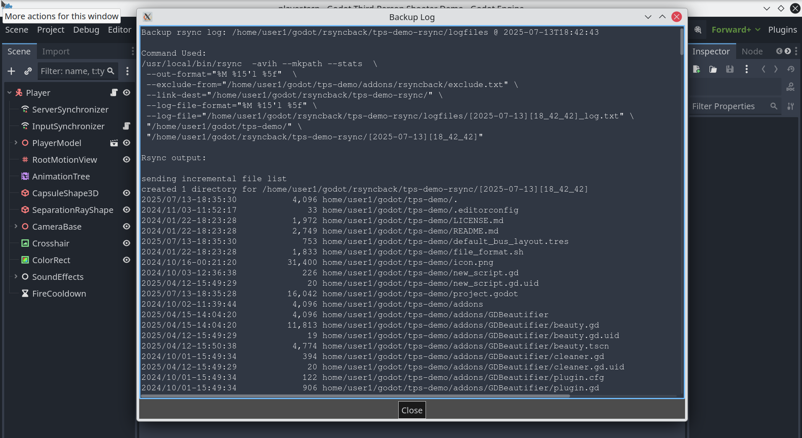
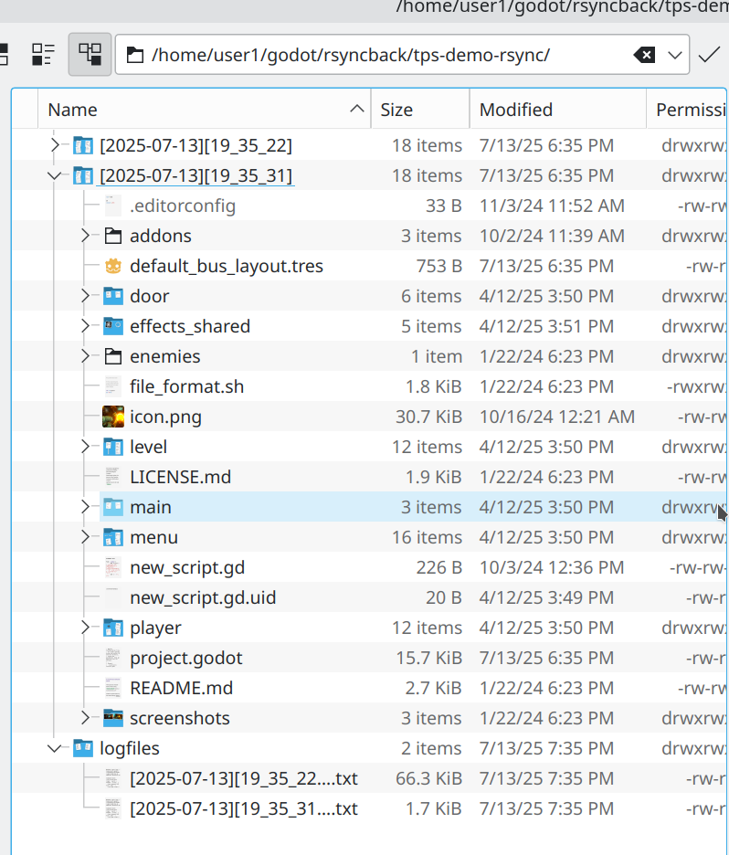

<h1 align="center">RsyncBack: Godot Projects Backup</img></h1>

<h2 align="center">Plugin Documentation For Linux, MacOSX and Windows(*)</h2>

## <ins>Introduction</ins>
RsyncBack is an addon plugin for Godot 4+, that comes <strong>rsync</strong> installed on Linux/MacOSX and available for Windows, to create fast [incremental date-stamped backups](#what-are-incremental-backups-using-hard-links) of your Godot projects with a one click of a button. For more detailed description of <strong>rsync</strong> click [what is rsync?](#what-is-rsync)...

The main usage for RsyncBack plugin is to be a Godot GUI front end and to make it simple to quickly setup backup your project. Once installed and configured, the plugin can be run with just the click of a button to make date-stamped incremental backups of your project source files. The backups can be to any internal or external drive. Each date-stamped backup is its own folder, having the name `[YYYY-MM-DD][HH-MM-SS]`. In addition, it saves storage, because the destination will not contain duplicate copies of files that have not been modified, but rather a hardlink to the original. When you check the backup folders, it will look and feel like a complete backup of your source. More on this later.

## <ins>Quick Setup/Run RsyncBack plugin</ins>

**Note:** This plugin, requires the binary **rsync** min ver. 3.2.4 to be installed on your system. For Linux and MacOSX it should come preinstalled but verify [here](#check-if-rsync-is-installed). Windows click [Windows Users](#windows-users). 
Once verified continue with the steps below.

Install RsyncBack plugin and perform a backup as follows: ( See [Uninstall](#uninstall-rsynback) if you wish to remove RsyncBack )


1. Clone directly from Github to the <em>./addons</em> folder below your project (No git? Click [Alternate Download Method](#alternate-download-method)):
```
    cd <your Godot project>
    mkdir addons   # make addons dir if you dont have one
    cd addons
    git clone https://github.com/silocoder/rsyncback.git
```
<a id="bookmark1"></a>

2. Open your Godot project and enable the RsyncBack plugin in Godot’s Menu > <em>Project > Project Settings > Plugins</em>. This will display the RsyncBack menu link at the top of the editor.

3. To make a backup, click on the RsyncBack and a configuration screen similar to **Fig 1** will open. Here you select the **rsync** executable path (which may already have been detected), the backup path as well as other options. 


<!--  -->
<p align="center"><b>Fig 1</b></p>

4. If **rsync** is installed (normally part of Linux ad MacOSX) and in the $PATH environment (usually <em>/usr/local/bin/ or /usr/bin/</em> ), the <ins>Rsync Cmd Path</ins> label will show the path and version. If not you can manually choose it by clicking on <ins>Rsync Cmd Path</ins> label see the section below [Check if rsync is installed](#check-if-rsync-is-installed) 


5. Click on <ins>Backup Destination Path</ins> and pick a folder, <ins>*outside of your project*</ins> to use for backup. At this point you will see your screen changed similar to **Fig 2**. and the <ins>Run Rsync</ins> button enabled.


<!--  -->
<p align="center"><b>Fig 2</b></p>

6. Click on the <ins>Exclude File</ins> and edit any patterns of files you want to exclude from backup. One line per pattern. You can use normal file search patterns.

- Example to exclude *.godot*, or any *.git* folders:
```
    .godot
    .git*
```

For more info in exclude patterns click here: [rsync exclude pattern matching rules](https://download.samba.org/pub/rsync/rsync.1#PATTERN_MATCHING_RULES)

7. To start the backup, click on the **Run Rsync** button and a popup report will show your project files backed up. The first backup is the longest as the complete project folder is backed up. See example **Fig 3**.


<!--  -->
<p align="center"><b>Fig 3</b></p>

8. Close the report and click on <ins>View Backup Destination Path</ins> label to review your backup and the log file. You should see the backup folders similar to **Fig 4**

<p align="center"></p>
<!--  -->
<p align="center"><b>Fig 4</b></p>

Review the latest backup folder (`[YYYY-MM-DD][HH-MM-SS]` ) as well as logfiles.

9. Go back to editing your project (e.g. clicking on Script). When ready to backup again click on RsyncBack link to open the plugin screen and then click the <ins>Run Rsync</ins> button.  A new report will show only the changed files that were backed up. Clicking on the <ins>View Backup Destination Path</ins> to review the backups in that folder.

## <ins>Next steps</ins>
At this point you can repeat step 9 above as many times as you want and new incremental backups will be created. If you need to reset the path configurations, you can click on the <ins>Config File</ins> label and will allow you to reset to defaults or manually edit the config file in the inspector. If you reset the defaults, you can still reuse the same backup folder and rsync will make a new incremental backup based on any existing backups.

As an example if you were backing up your project */home/user1/godot/tps-demo* to a folder
*/home/user1/godot/godotbackups*, then RsyncBack would create a top folder like this:
*/home/user1/godot/godotbackups/tps-demo-rsync* and all backups and logfiles would be found here.

## <ins>What are incremental backups and how are hard-links used?<ins>

Incremental backup in the case of RsyncBack (which uses **rsync**), is when the changed files in your project are backed up to a new date-time stamped folder. When **rsync** runs, it compares the current project to the previous backup. If any files have changed, then a new copy of the files is made to the new backup folder.

In addition hard-links ([https://en.wikipedia.org/wiki/Hard_link](https://en.wikipedia.org/wiki/Hard_link)) are created in that same back up folder to the unchanged files. In essense, your backup folder looks like a complete backup. Every new backup is quick and takes less storage. The backup folders are date-time named stamped. Many backups including RsyncBack work on the basis of using hardlinks to save space and time and make it easy to see your complete backup.

If you look at the latest backup folders they are exact replicas of your project. This means you can just copy the complete folder and open it with Godot. 

## <ins>What is rsync?<ins>

Rsync is one of the most popular and stable open source backup tools included with Linux and MacOSX (Windows see below [Windows Users](#windows-users)). It is a terminal run tool with numerous options and arguments for backing up your computer folders incremental/differential, It has been battle tested for years now, is very reliable and has great community support. In its basic form it is a copy/sync tool, in that it copies files from source folder to a destination folder. Rsync backs up files using the native file system of your computer. It does not have its own compressed or proprietary database. You can easily use your File Manager to restore with drag and drop any backup folder or individual files. You can of course view them as regular files using your favorite File Manager. For Linux it could be Dolphin/Nemo/etc and Mac it could be Finder. Or it could be the command line using <b>ls</b>. 

## <ins>Check if rsync is installed.</ins>

Before you begin, check that rsync is installed on your system. You can easily check from the command line by running the following terminal commands:  <strong>which rsync</strong> to show you the default path or <b>whereis rsync</b> to check if there are more than one installed. RsyncBack requires version 3.2.4 or above. See example below. To choose the desired rsync path, click on the label Rsync Cmd Path

<b>~$ `which rsync`</b></br>
`/usr/local/bin/rsync`

or

<b>~$ `whereis rsync`</b></br>
`rsync: /usr/bin/rsync /usr/local/bin/rsync /usr/share/rsync /usr/share/man/man1/rsync.1.gz`

<b>~$ `rsync -V`</b></br>
`rsync  version 3.2.7  protocol version 31
Copyright (C) 1996-2022 by Andrew Tridgell, Wayne Davison, and others.
.......`

[Back to installing RsyncBack plugin](#quick-setuprun-rsyncback-plugin)


## <ins>Windows Users<ins>
### Installing and running rsync on Windows.

The RsyncBack addon is installed as usual with [instructions above](#quick-setup-and-run-rsyncback). However you need to tell it where the **rsync.exe** command is located. To do that you would need to install MSYS2 which is a list of Linux commands that run native on Windows. An open source consortium called MSYS2 created popular Linux commands that run natively on Windows. There is no need to install Linux to do that!

From their documentation page at [https://www.msys2.org](https://www.google.com/url?q=https://www.msys2.org&sa=D&source=editors&ust=1752710978297009&usg=AOvVaw2IBV09jFifKjKXb5G7c51c)/:

- MSYS2 is a collection of tools and libraries providing you with an easy-to-use environment for building, installing and running native Windows software.

Additional docs here: [https://www.msys2.org/docs/what-is-msys2/](https://www.google.com/url?q=https://www.msys2.org/docs/what-is-msys2/&sa=D&source=editors&ust=1752710978297700&usg=AOvVaw165IvSn3UOk0Q4QzYSHp4r)

On your Windows browser, follow this link [https://www.msys2.org/#installation:](https://www.google.com/url?q=https://www.msys2.org/%23installation&sa=D&source=editors&ust=1752710978298153&usg=AOvVaw2ylkCiPCa0C4eZjIyvGIDy) and the instructions to install the msys2 executable.

This will create a native windows folder followed by the path to Linux exe commands. You can then install <i>rsync</i> from the terminal that opens up running the <i>pacman</i> installer as follows:

```pacman -S rsync```

It then runs natively under Windows with this command:

```c:/msys64/usr/bin/rsync.exe```

So in this case, you would choose the path above, in the RsyncBack plugin screen, as the path for rsync.

Note: There are a few articles online on how to install MSYS2 and rsync. In fact here is one explaining how to do it if you are using Git. [https://tlundberg.com/installing-rsync-on-windows](https://www.google.com/url?q=https://tlundberg.com/installing-rsync-on-windows&sa=D&source=editors&ust=1752710978300371&usg=AOvVaw24eApOnMICqLL6VHAzBxVx)

From the article: If you didn't already know, Git for Windows and its Git Bash environment is built using [msys2](https://www.google.com/url?q=http://msys2.org/&sa=D&source=editors&ust=1752710978300813&usg=AOvVaw335tSAbpp4EALksPZui4UQ), but it doesn't include all the binaries from that project.

[Back to installing RsyncBack plugin](#quick-setuprun-rsyncback-plugin)

## <ins>Backup Folders Layout and Restore<ins>

As we said before, RsyncBack creates an rsync command that incrementally backs up your project to your chosen backup folder. The backup folder will always be called <b>\<project name folder\>-rsync</b>. Inside this folder the backups are copied with the name <b>[YYYY-MM-DD][HH_MM_SS]</b>. Also the backup folder includes another folder called logfiles, where each backup’s report is kept. See **Fig A4** below.

The backup folders are exact ordinary folders of your project. To restore, you can copy or view using your system's File Manager.

<p align="center"></p>
<!--  -->

<p align="center"><b>Fig A4</b></p>

Even though it may look to you that in your latest folder the complete project was copied, in fact what you are seeing is an image copy of the previous backup overwritten by the files that are different. This is the power of Linux/Mac file system and it is all done in the background using hardlinks. It allows for efficient disk storage and speed. Rsync does that by comparing your source folder (ie your project folder) with the latest backup then copies the changed files to the destination. The unchanged are hardlinked. The option that does this is --link-dest=”your/last/backup/folder”  See example command below.

In fact every file you create is a hardlink to an inode. If you copy that file to another folder it does not duplicate it. It simply makes a directory entry pointing to what is called an inode. Inodes are beyond the scope of this document, but if you are curious about inodes read this short writeup I found [https://albertoalcolea.com/blog/incremental-backups-with-rsync-+-hard-links](https://albertoalcolea.com/blog/incremental-backups-with-rsync-+-hard-links/)

## <ins>Customizing the Defaults of RsynBack.</ins>

A new install of RsyncBack initially reads the choices from a resource file called <b>addons/rsyncback/resource/config.tres</b> ( or if missing, then it makes a copy of **default_config.tres**). The user then makes the selections and runs the backup. This <b>config.tres</b> can be manually edited in the Inspector. The simplest way to do that is to click on the <em>Config File</em> label link and select Edit In Inspector (Make sure Inspector is showing in the dock). The Godot Inspector will load the <b>config.tres</b> resource file and allow you to make the changes manually and save the config file. Make sure you reload the plugin.

Hover over each of the <b>config.tres</b> properties and read the tooltip for more info. The Rsync Arguments Template is where you would customize further the rsync command options.

It looks similar to this:

```
{dry_run_argument} -avih --mkpath --stats  \
 --out-format="%M %15'l %5f"  \
 --exclude-from="{exclude_file_path}" \
 --link-dest="{dest_path}/{project_name}/{prev_backup}" \
 --log-file-format="%M %15'l %5f" \
 --log-file="{log_file_path}/{current_datetime}{log_file_suffix}" \
 "{source_path}" \
 "{dest_path}/{project_name}/{current_datetime}"
```

The curlies {} are properties replaced by RsyncBack when you run the backup. In effect the above becomes this command which is what runs.

```
/usr/local/bin/rsync  -avih --mkpath --stats  \
 --out-format="%M %15'l %5f"  \
 --exclude-from="/home/user1/godot/tps-demo/addons/rsyncback/exclude.txt" \
 --link-dest="/home/user1/myback/tps-demo-rsync/[2024-10-16][13_22_37]" \
 --log-file-format="%M %15'l %5f" \
 --log-file="/home/user1/myback/tps-demo-rsync/logfiles/[2024-10-18][17_07_35]_log.txt" \
 "/home/user1/godot/tps-demo/" \
 "/home/user1/myback/tps-demo-rsync/[2024-10-18][17_07_35]"
```

In fact you will see this command in the Rsync Command window. You can click and copy it to the clipboard and run it directly in the command line if you wish!

Notice the rsync command is added from the path you chose. Also <em>{dry_run_argument}</em> is not used in this case since we didn’t check the box. Dry run does not make a backup but simply executes to see if your command is ok. It is always reset back.

You can modify this template anyway you want. E.g. add a remote backup ssh keyfile or add –delete option. Study up on rsync if you plan to customize the template.

### <ins>Description of **rsync** template parameters</ins>
(See more https://download.samba.org/pub/rsync/rsync.1#OPTION_SUMMARY):

```
-avih       # archive-mode, recursive, verbose, human-readable
--mkpath    # create the backup path if it does not exist
--stats     # statistics at the end of the transfer
--out-format=   # Report format 
--link-dest=    # Path to the last backup folder
--log-file-format=  # Log file format, in this case it's same as out-format
--log-file=    # Path to log file
"source code path"  # Your current Godot project path
"backup path"   # The new backup path folder
```
## <ins>Alternate Download Method</ins>

1. In your browser, navigate to https://github.com/silocoder/rsyncback 
1. Making sure master branch is selected, click on the green **Code** button and select Dowload Zip
1. Save the rsyncback-master.zip file into the ./addons folder of your project.
1. Unzip the zip contents into a folder named ./addons/rsyncback. If you use command line unzip it should look something like: 
1.  ```unzip rsyncback-master.zip``` # unzip master folder <br>
```mv rsyncback-master rsyncback```  # rename folder to rsyncback
1. Delete the rsyncback-master.zip file

[Back to installing RsyncBack plugin](#bookmark1)

## <ins>Uninstall RsynBack</ins>

Of course you may want to either disable RsyncBack or completely uninstall it. To disable the plugin click on Godot’s Menu > <em>Project > Project Settings > Plugins</em> and uncheck the RsyncBack box.

To completely remove it, just delete the **rsyncback** plugin folder inside the addons folder of your project. This will remove the plugin. However any backups are not affected, although you should check that you did not backup anything inside the **rsyncback** folder you may want to keep.

You may have to restart your project after deleting plugins.

## Other Notes:
A Godot project typicaly has two folders: **res://** for the project, and **user://** for runtime data. Only the **res://** folder is backed up with this template. You can add the **user://** folder to the RsyncBack template if you need to. However you have to hardcode the source path to your **user://** folder and then add the project name, something like this below: (ALWAYS TEST ANY CHANGES TO THE TEMPLATE)

```
{dry_run_argument} -avih --mkpath --stats  \
 --out-format="%M %15'l %5f"  \
 --exclude-from="{exclude_file_path}" \
 --link-dest="{dest_path}/{project_name}/{prev_backup}" \
 --log-file-format="%M %15'l %5f" \
 --log-file="{log_file_path}/{current_datetime}{log_file_suffix}" \
 "{source_path}" "/home/user1/.local/share/godot/app_userdata/Godot Third-Person Shooter Demo" \
 "{dest_path}/{project_name}/{current_datetime}"
```

Notice the sources line above: 

` "{source_path}" "/home/user1/.local/share/godot/app_userdata/Godot Third-Person Shooter Demo" \`

the second path is your project's **user://** folder. Make sure NOT to ADD a path delimiter (/) at the end so the **user:// ** folder can be create a separate subfolder inside your backup.

*TIP*: In the same way, you can add a list of other folders to backup. They will all be backed up under the destination path folder.

## <ins>References:</ins>

|   |   |
|---|---|
|Official rsync Website|[https://rsync.samba.org](https://rsync.samba.org)|
|rsync man page|[https://download.samba.org/pub/rsync/rsync.1](https://download.samba.org/pub/rsync/rsync.1)|
|Command line tutorial/Examples|[https://www.geeksforgeeks.org/rsync-command-in-linux-with-examples/](https://www.geeksforgeeks.org/rsync-command-in-linux-with-examples/)|
|Incremental backups with rsync + hard links|[https://albertoalcolea.com/blog/incremental-backups-with-rsync-+-hard-links/](https://albertoalcolea.com/blog/incremental-backups-with-rsync-+-hard-links/)|
|Installing rsync for Windows.|[https://www.msys2.org/](https://www.msys2.org)|


